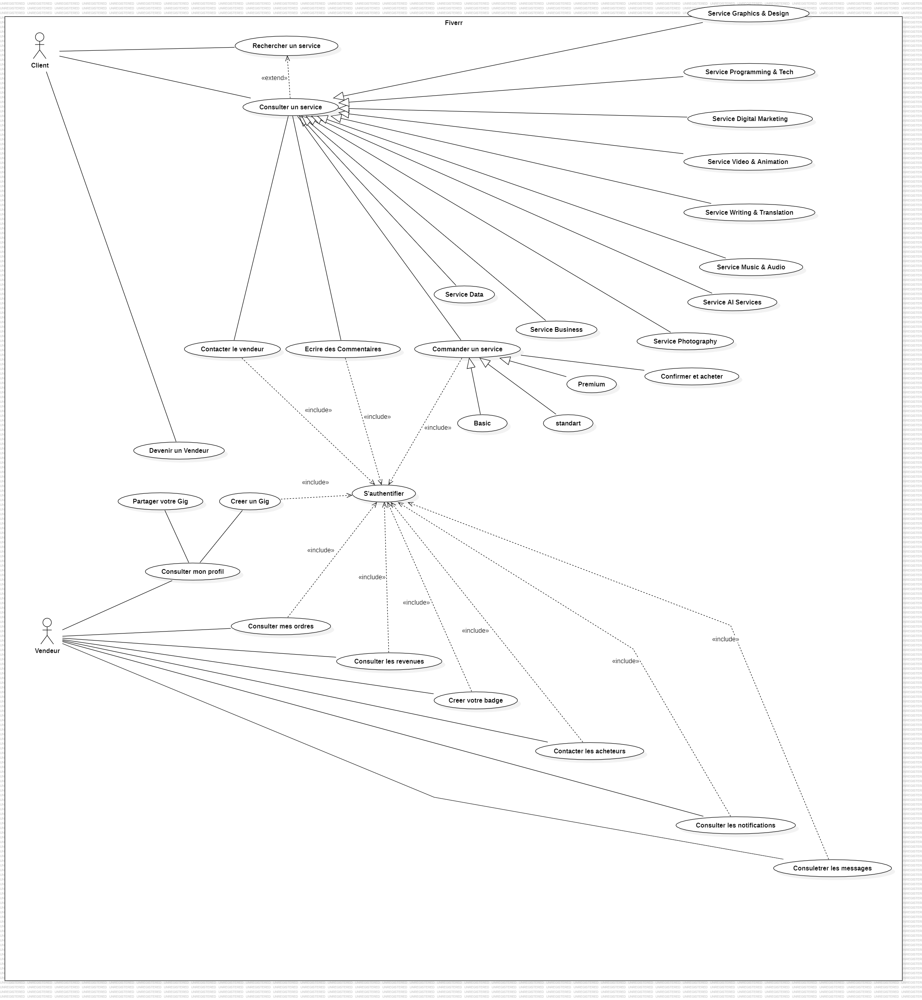
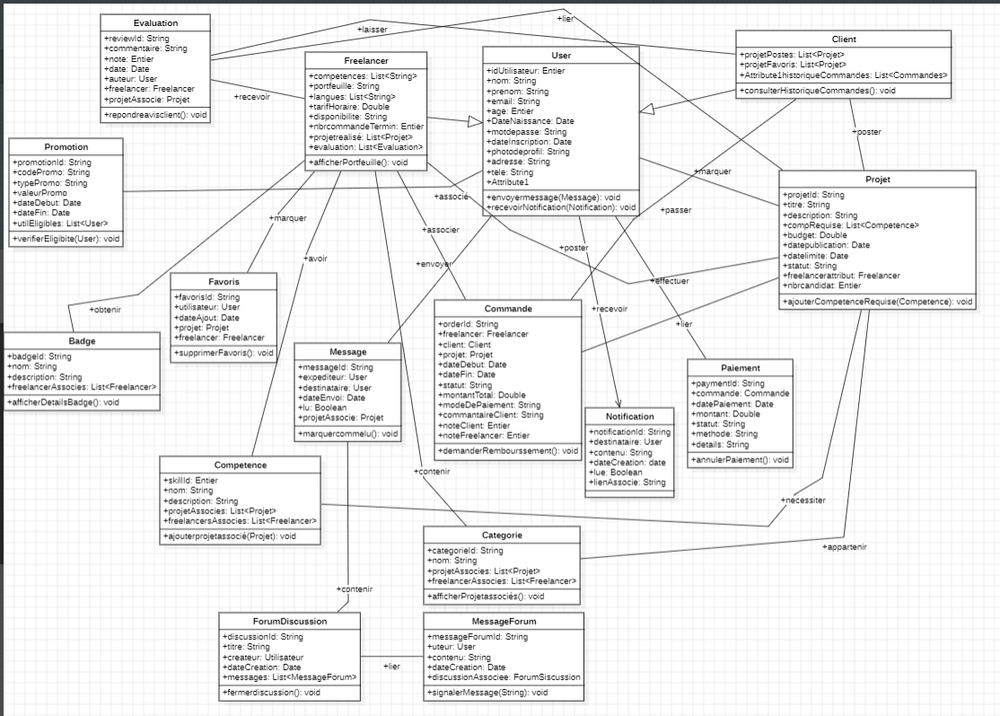
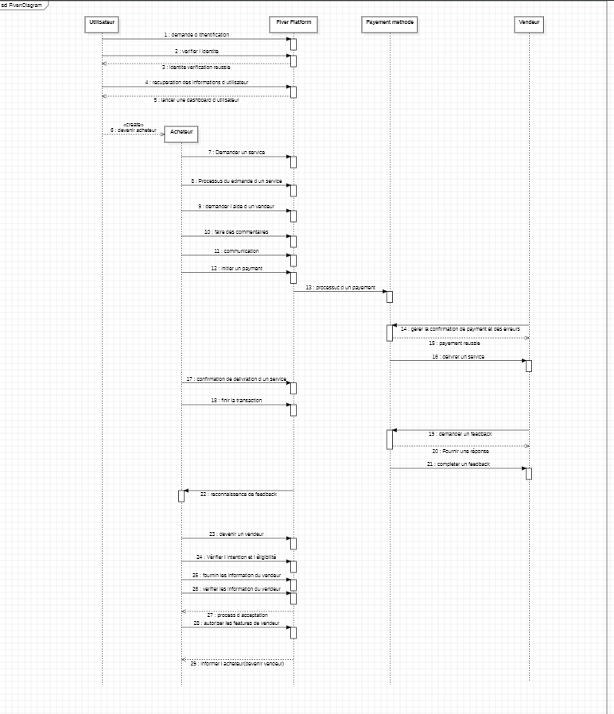

 

  

   <h3 align="center">Fiverr Diagrams</h3>

  

    An awesome Project about fiverr diagrams!
     
    <a href="https://github.com/ZakariaLagraini/uml"><strong>Explore the docs »</strong></a>
     
     
    <a href="https://github.com/ZakariaLagraini/uml">View Demo</a>
    ·
    <a href="https://github.com/ZakariaLagraini/uml">Report Bug</a>
    ·
    <a href="https://github.com/ZakariaLagraini/uml">Request Feature</a>
  

  
Table des matières

  <ol>
    <li>
      <a href="#about-the-project">À propos du projet</a>
      <ul>
        <li><a href="#Use case diagram">Diagramme de cas d'utilisation</a></li>
        <li><a href="#Class diagram">Diagramme de classes</a></li>
        <li><a href="#Sequence diagram">Diagramme de sequence</a></li>
      </ul>
    </li>
    <li>
      <a href="#Conclusion">Conclusion</a>
      </li>
      <li>
      <a href="#Contributers">Contributeurs</a>
      </li>
    </ol>

## À propos du projet

Notre projet vise à créer une plateforme de freelance inspirée par les fonctionnalités de Fiverr. Fiverr est une plateforme en ligne qui met en relation des freelances avec des clients cherchant des services variés, allant de la rédaction de contenu à la conception graphique.

## Diagramme de cas d'utilisation

* Le diagramme de cas d'utilisation illustre les interactions entre les acteurs (freelances et clients) et le système. Il met en lumière des fonctionnalités telles que la recherche de services, la soumission de propositions, la gestion de portefeuilles et la notation des services.

## Diagramme de classes

* Le diagramme de classe modélise la structure statique du système, détaillant les entités principales telles que les utilisateurs, les services, les transactions, etc. Les relations entre ces entités sont clairement définies, permettant une compréhension approfondie de la base de données sous-jacente.

## Diagramme de sequence

* Le diagramme de séquence représente les interactions dynamiques entre les objets du système au fil du temps. Dans le contexte de notre projet, il montre comment un utilisateur recherche un service, soumet une proposition, et finalise une transaction.

## Conclusion

En combinant les éléments du cahier des charges avec ces diagrammes, notre objectif est de développer une plateforme de freelance robuste et conviviale, offrant une expérience utilisateur similaire à celle de Fiverr tout en répondant aux besoins spécifiques de notre marché cible.

## Contributeurs

